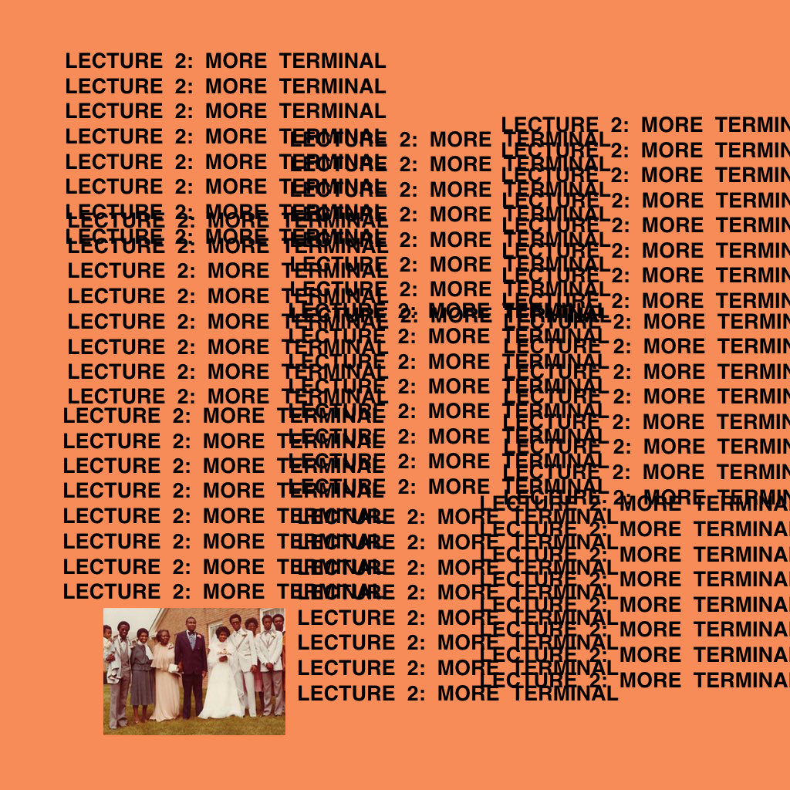
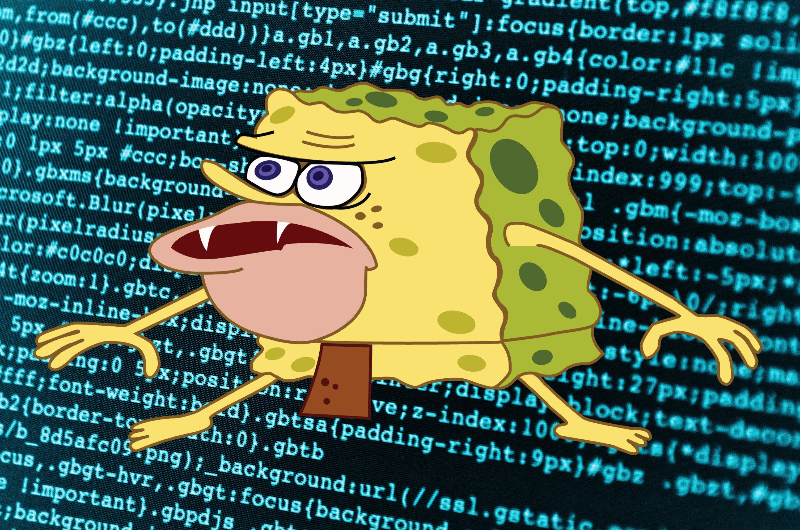

# CS 190: Tools
### September 6, 2016 <!-- .element: class="subtitle" style="text-align: center"-->


# Welcome back!
 <!-- .element: class="center" style="width: 50%"-->


# First, some review <!-- .element: style="text-align: center"-->


## Quiz 2.1
What do `.` and `..` represent in your terminal, respectively?

A. The end of a command and a "wildcard."

B. The home directory and "back" one directory.

C. The current directory and the parent directory.

D. The system root directory and the configuration folder.


## Quiz 2.1 Answer
What do `.` and `..` represent in your terminal, respectively?

A. The end of a command and a "wildcard."<!-- .element: style="color: grey;"-->

B. The home directory and "back" one directory.<!-- .element: style="color: grey;"-->

**C. The current directory and the parent directory.**

D. The system root directory and the configuration folder.<!-- .element: style="color: grey;"-->


## Reminder...

| symbol | what it does                           |
| ------ | -------------------------------------- |
| `*`    | wildcard (matches anything)            |
| `..`   | parent directory (up one folder)       |
| `.`    | current directory (you are here)       |
| `cd -` | go back (like in your browser)         |
| `~`    | home directory (you live here)         |
| `/`    | root directory (everything lives here) |


# More Terminal Tips <!-- .element: style="text-align: center"-->


## Tab completion
```
# use tab to have the terminal finish commands for you
~ » ls some_rea<tab>

# becomes...
~ » ls some_really_long_folder_name

# most shells will let you know if there are multiple matches
~ » cp file<tab>
file1 file2 file3
```
<!-- .element: class="hljs nohighlight"-->


## History
```
# use the up arrow to navigate through the history of previous commands
~ » <up-arrow>

# becomes...
~ » cp file1

# use bang bang to substitute the last command
~ » echo !!

# becomes...
~ » echo cp file1
```
<!-- .element: class="hljs nohighlight"-->


# Input and Output <!-- .element: style="text-align: center"-->


- The terminal functions on a system of input and output.
- Users input commands, terminals output results (or take some kind of action).


## Standard Input
- The standard input stream, or "`stdin`," is the default input source for the terminal.
- Commands you type at the shell prompt feed into `stdin`.
- Most programming languages offer constructs to interface with `stdin`, such as Scanner in Java.


## Standard Output
- The standard output stream, or "`stdout`, " is the default place for the terminal to display output.
- Almost everything you see on your terminal is from `stdout`.
- Printing functions in programming languages rely on `stdout`, like Java's System.out family of methods (`println`, `printf`).


## Redirection
```
# use < to change the source for stdin
~ » java Statistics < numeric_data

# and use > to change the destination for stdout
~ » ls > list_of_files

# or use both at once
# example: put sadness into Tumblr, get memes out
~ » java Tumblr < sadness > memes
```
<!-- .element: class="hljs nohighlight"-->


## Pipes
```
# pipes let you feed the output of one command to the input of another

# see if a specific file is in a specific folder
~ » ls folder_with_lots_of_files | grep a_very_special_file

# get the number of lines of code for your lab
~ » cat Code.java | wc -l
```
<!-- .element: class="hljs nohighlight"-->


# Searching <!-- .element: style="text-align: center"-->


## Find
- the `find` command will search a directory and **all** of its subdirectories.
- Example: Jack searches his CS 348 directory for a file
    ```
.
├── assignments
│   ├── assignment1.html
│   ├── assignment1.md
│   └── assignment1.pdf
├── projects
│   └── project1
│       ├── p1_hankinsj.sql
│       └── project1.md
└── scripts
    └── insert.sql
    ```


```
.
├── assignments
│   ├── assignment1.html
│   ├── assignment1.md
│   └── assignment1.pdf
├── projects
│   └── project1
│       ├── p1_hankinsj.sql
│       └── project1.md
└── scripts
    └── insert.sql
```
- Result: `find` will look in his "assignments", "projects", his "project1", and his "scripts" directories until it finds the correct file.


##  &#9888; Warning  &#9888; <!-- .element: style="text-align: center"-->
* Never, ever run the find command with the search starting at the / directory. The is essentially the top rule of the CS department. 

```bash
# DO NOT EVER RUN THIS!!
find / -name Shape.java
```


## `find` - locate files
```bash
# allowed
find ~/ -name Shape.java
 
# allowed if your current working directory is at or within your home directory
find . -name Shape.java
 
# allowed if myfolder is at or within your home dir
find cs180/ -name Shape.java
```


## `find` - locate files
```bash
# find a file within my cs190lab1 folder or below named dogbark
find ~/cs190lab1 -name "dog_bark"
 
# find all files within my cs190lab1 folder or below starting with 'dog'
find ~/cs190lab1 -name "dog*"
```


## `find` - locate files
```bash
# find all .class files in my cs180/ directory or below and delete them
find ~/cs180 -name "*.class" -exec rm {} \;

# rm is the command to apply to each file found.
# The {}'s are a placeholder for each file that the find command locates
# The \; is the end of the -exec command
```


## `grep` - file pattern searcher
- `grep` searches input files for lines containing a match to a given pattern list

```bash 
grep "<search term>" <files to search>

# Arguments
# -n : show line number of occurrence
# -i : case-insensitive search
# -w : match whole word  
# -r : search recursively in sub-folders
```


## `grep` - file pattern searcher

```bash
# search within files of the project5 folder 
# for occurrences of the text "main"
grep -n "main" ~/cs180/projects/project5/*
 
# search all files in ~/cs180 and its 
# subfolders for the whole word "ShapeFactory"
grep -nrw "ShapeFactory" ~/cs180/
```


# The Internet


## `wget` - network downloader
```bash
wget <website>
```


## `wget` - network downloader
```bash
# download page of a website
wget https://jayhankins.me

# download an entire website recursively
# (use caution)
wget -r https://jayhankins.me
```


## `wget` - network downloader
* Note: `curl` is another option. It has some differences from `wget`, but can accomplish the same things. Different operating systems may only include one of these tools.
* [curl vs. wget](https://daniel.haxx.se/docs/curl-vs-wget.html)


# Working with Text


## `wc` - word, line, and character count
```bash
# Print the number of lines, words, and characters of file
wc book.txt
 
# Print the number of lines, words, and characters from standard input
cat book.txt | wc
```


## `sort` - sort lines of text files
```bash
# Sort a text file and overwrite the same file
sort student_list.txt > student_list.txt
 
# list contents of directory and sort the output and save to file
ls -al | sort > output.txt
```


# Quiz


## Quiz 2.2
What command are you ***not allowed*** to run 

A. `find ~/cs180/ -name Shape.java` 

B. `find ~/ -name Shape.java`

C. `find /homes/brown886 -name Shape.java`

D. `find / -name Shape.java`

E. They are all allowed


## Quiz 2.2 Answer
What command are you ***not allowed*** to run 

A. `find ~/cs180/ -name Shape.java`<!-- .element: style="color: grey;"-->

B. `find ~/ -name Shape.java`<!-- .element: style="color: grey;"-->

C. `find /homes/brown886 -name Shape.java`<!-- .element: style="color: grey;"-->

**D. `find / -name Shape.java`**

E. They are all allowed <!-- .element: style="color: grey;"-->


# Announcements


### When you realize it's time to start applying for internships<!-- .element: style="text-align: center"-->
 <!-- .element: class="center" style="border: none; box-shadow:none; width:50%;"--> 


## Upcoming Career Fairs
* AITP Computing Career Fair:
    - **Thursday, September 8, 9:00 am - 3:00 pm**
* CS Career Fair: 
    - **Monday, September 12, 5:00 pm - 8:30 pm**


 <!-- .element: style="border: none; box-shadow:none; width:15%;"--> 
## Internships at Cisco
* Jay Hankins is Purdue's Cisco Campus Ambassador
    - And a two-time security intern in RTP, North Carolina
* Kiley Dove is Purdue's Cisco Recruiter (<kidove@cisco.com>)
* https://cisco.com/go/university


## Cisco Events
* [Positions at Cisco](https://drive.google.com/file/d/0B6T9Y1awPtf7TWkxRHJhMXJSMlBDWnkzTTEwMU5ubDctNkNV/view?usp=sharing)

<!-- .element: class="center" style="border: none; box-shadow:none; width:75%;"--> 


* At both career fairs
* Networking Night (Skip the career fair lines)
    - Wednesday, September 7, 6:00 pm - 8:00 pm
    - Lynn Hall (Veterinary Building)

