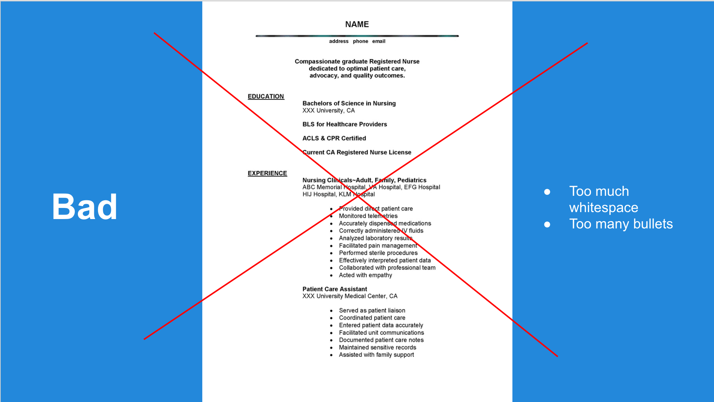
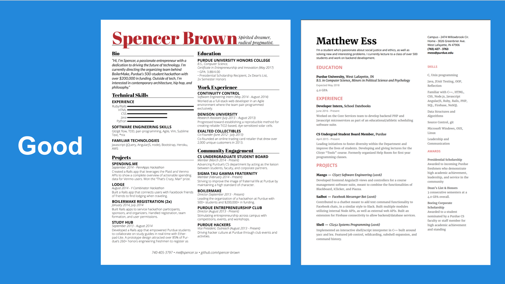
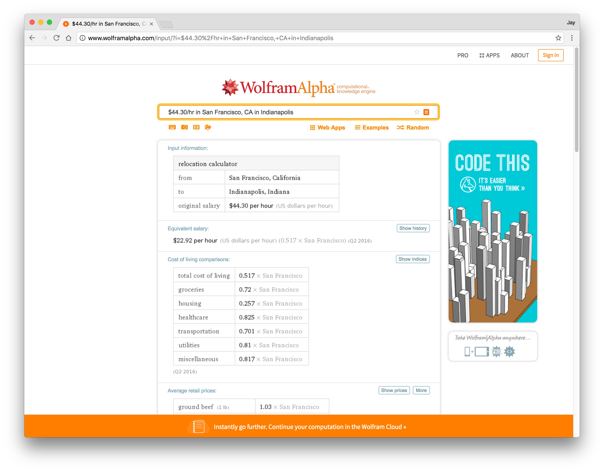

<!-- .slide: data-background-image="assets/theend.gif" -->


# CS190: Tools
### November 29, 2016
<!--.element: class="subtitle" style="text-align: center" -->


# Lecture 8:
### Be Awesome <!-- .element: class="subtitle" style="text-align: center" -->


## Tips and Tricks: 
<!--.element: style="text-align: center;" -->
### Make your workflow wonderful
<!--.element: class="subtitle" style="text-align: center; font-size: 24pt; margin-top: -20px;" -->


## SSH Keys<!-- .element: style="text-align: center"-->


## SSH Keys
* SSH keys provide a more secure way of logging into a server than using a password alone.
* It also means **no more passwords**! <span style="font-size: 16pt;">(kinda)</span>
* SSH keys are *paired keys* which means that each key has a public part and a private part.


## SSH Keys (continued)
* Private Keys (`~/.ssh/id_rsa`)
  - Stays on the client machine (your personal computer)
  - Never ever ever give them to anyone
* Public Keys (`~/.ssh/id_rsa.pub`)
  - Stays on the remote machine (the server you're connecting to)
  - This is the part of the key you give out


## SSH Keys (continued)
* `~/.ssh/authorized_keys` is the file you place public keys in.
<!-- .element: class="center" style="border: 0; box-shadow: none;"-->


## SSH Keys (continued)
<!-- .element: class="center" style="border: 0; box-shadow: none;"-->


## How to set up SSH keys
1. Generate a pair of SSH keys
  - will be stored in ~/.ssh/
  - default name is id_rsa and id_rsa.pub
2. Copy contents of `id_rsa.pub` and paste into `~/.ssh/authorized_keys` of a remote server.
  - create the authorized_keys file if needed
  - append the public key to the end of the file.


## Personal Computer Setup<!-- .element: style="text-align: center"-->


## Windows Development Machine
* [Install Bash on Ubuntu on Windows](https://github.com/Purdue-CSUSB/CS-190-F2016/blob/master/tutorials/shells/bash-on-windows.md)
* Install WinSCP (easy file transfer to/from CS servers, directory synchronization)
* Install a virtual machine hypervisor, like VMWare Workstation or Oracle VM Virtualbox.
  - for running different OSes inside of Windows
* Install Docker for Windows?


## Mac Development Machine
* Install Xcode (at least the command line utilities)
* Install iTerm2
* Install brew and cask package managers
* Install Alfred
* Install Spectacle or BetterTouchTool, which gives you "snap" functionality on application windows.
* Install Docker for Mac?


## Need a server to play around with?
* [DigitalOcean](https://digitalocean.com) has $50 student credit through the [GitHub Student Pack](https://education.github.com/pack).


## Need some commercial (paid) software?
* Need some commercial software? Purdue probably has a discount at [OnTheHub](https://purdue.onthehub.com)! 
* Check ITaP for details: https://www.itap.purdue.edu/shopping/software/student.html


## Other Tools
* Supercharge your Gmail/Google Inbox with [Mixmax](https://mixmax.com/).
* Manage your passwords with [LastPass](https://lastpass.com) or [Enpass](https://enpass.io).
* Save time with a text expander (demo).
* Up your note-taking game with [Notion](https://notion.so).
* Automate your life with [IFTTT](https://ifttt.com).
* https://jayhankins.me/tools


## How to Get Your First Internship
<!-- .element: style="text-align: center; color: white; font-weight:bold; font-size: 36pt; background: rgba(13, 13, 13, 0.8);"-->
<!-- .slide: data-background-image="assets/interns.jpg" -->


## Why Are Internships Important?
* Internships are experience. Experience helps you get jobs.
* $$$


<!-- .element: class="center" style="border: 0; box-shadow: none;"-->


## FYI
* These are my opinions, not objective truths.
* I'm confident all of you can find internships.
* You'll have to work hard.
* You're most likely not going to work at Google your first year, and that's okay.


## Step 1: Make a Good Resume
* CCO/Purdue workshops get you to a baseline level, but not too *good* or even *great*.
* CCO resume reviewers are just Purdue students looking at a checklist.


## Keys to a Good Resume
* Follow basic rules you can learn online / from Purdue and expand as you get more comfortable.
* Get as much feedback as you can from people with more experience than you. Feel free to email any of the CS 190 staff.
* Distinguish yourself with design.
* Don't use <span style="font-family: 'Times New Roman'">Times New Roman</span>
* Include your GitHub!
* Keep a few different formats of your resume.



<!-- .element: class="center" style="border: 0; box-shadow: none;"-->



<!-- .element: class="center" style="border: 0; box-shadow: none;"-->


## Step 2: Work on side projects
* "Side projects" = software projects built outside of class
* Why are they important?
    - They show initiative to learn and build outside of class.
    - You can distinguish yourself with side projects.


<!-- .element: class="center" style="border: 0; box-shadow: none;"-->


## What should I work on?
* Languages you are interested in.
* Web languages (JavaScript, Ruby on Rails)
* iOS or Android, mobile web
* **Just get good at something**
* **Make something that interests you**


## Step 3: Apply for positions


## Shotgun Approach
* Set a goal of applications for yourself (50+)
* Apply at startups: [AngelList (angel.co)](https://angel.co)
* [Apply Everywhere (https://goo.gl/6B5GRK)](https://goo.gl/6B5GRK)


## Where Else to Look
* Personal connections!
* Hackathons / <span style="font-size: 16pt">career fairs</span>
* [Hacker News (https://news.ycombinator.com)](https://news.ycombinator.com)


## Step 4: Interviewing
* Read *Cracking the Coding Interview*
* Glassdoor.com and Careercup.com may have example interview questions from past interviewees.


## Salary Converter

<!-- .element: class="center" style="border: 0; box-shadow: none; width:100%; max-height: unset; max-width: unset;"-->


## Some Simple Hints
<!-- .element: style="text-align: center"-->


## Some Simple Hints
* In CS, it is about **what you make**.
* Grades aren't everything.
* Clubs and organizations can have a big impact
* **Don't** wear a suit, tie, or dress shoes to a CS interview
  - A few exceptions: IBM, Bloomberg
* **Do** wear a nice pair of jeans or khakis, clean shoes, and a nice button-down or sweater. Business casual is where it's at.


## Wrapping Up
<!-- .element: style="text-align: center"-->


<!-- .element: class="center" style="border: 0; box-shadow: none; width: 70%"-->
<p style="text-align: center">https://purdueusb.com<!-- .element: style="color: #DD6B27"--></p>


We are looking for freshmen who <!-- .element: style="text-align: center; font-size: 36pt;"-->

<!-- .element: style="text-align: center; font-size: 36pt;"-->**want to help better the CS department**. 


Be on the lookout in Spring 2017...
1. Apply
2. Interview
3. Do Great Things


<h2 class="" style="text-align: center; font-weight: 600"> Want to get involved with CS 190?<h2>
<p class="fragment" style="text-align: center; font-size: 28pt; letter-spacing: 1.3pt;">https://purdueusb.com/cs190/apply/ta</p>


## Final Course Evaluation
<!-- .element: style="text-align: center"-->
<br>
<!-- .element: style="text-align: center; font-size: 36pt;"-->**We want criticism.**


## Last i>clicker Quiz
```
while (you.EvaluatingCourses) {
  if (course.instructor == "Prof. Dunsmore") {
    course.instructor == "Jay & Matt";
    course.evaluate();
  }
}
```
<br>
<!-- .element: style="text-align: center; font-size: 16pt; margin-left: 50px; margin-right: 30px;"-->"I will fill out the course evaluation for CS 190. I understand that where it says "Professor Dunsmore", I will replace that with "**Jay & Matt**".

<br>
<!-- .element: style="text-align: center; margin-left: 50px; margin-right: 30px;"-->
**A.B.C.D.E.** I promise.


## Anything Else?<!-- .element: style="text-align: center"-->
#### Email us!<!-- .element: style="text-align: center"-->


<!-- .slide: data-background-image="http://i.giphy.com/xT5LMrPgPLbmz65dRu.gif" -->
