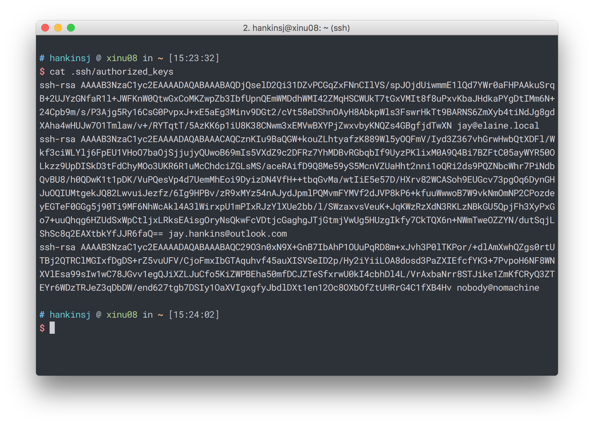

# CS190: Tools
### November 22, 2016
<!--.element: class="subtitle" style="text-align: center" -->

<!-- .slide: data-background-image="assets/theend.gif" -->

# Lecture 8:
### Be Awesome <!-- .element: class="subtitle" style="text-align: center" -->

## Tips and Tricks:
<!--.element: style="text-align: center;" -->
### Make your workflow awesome
<!--.element: class="subtitle" style="text-align: center; font-size: 24pt; margin-top: -20px;" -->

## SSH Keys<!-- .element: style="text-align: center"-->

## SSH Keys
* SSH keys provide a more secure way of logging into a server than using a password alone.
* It also means **no more passwords**! (kinda)
* SSH keys are *paired keys* which means that each key has a public part and a private part.

## SSH Keys (continued)
* Private Keys (`~/.ssh/id_rsa`)
  - Stays on the client machine (your personal computer)
  - Never ever ever give them to anyone
* Public Keys (`~/.ssh/id_rsa.pub`)
  - Stays on the remote machine (the server you're connecting to)
  - This is the part of the key you give out

## SSH Keys (continued)
* `~/.ssh/authorized_keys` is the file you place public keys in.
<!-- .element: class="center" style="border: 0; box-shadow: none;"-->

## SSH Keys (continued)
<!-- .element: class="center" style="border: 0; box-shadow: none;"-->

## How to set up SSH keys
1. Generate a pair of SSH keys
  - will be stored in ~/.ssh/
  - default name is id_rsa and id_rsa.pub
2. Copy contents of `id_rsa.pub` and paste into `~/.ssh/authorized_keys` of a remote server.
  - create the authorized_keys file if needed
  - append the public key to the end of the file.

## Personal Computer Setup<!-- .element: style="text-align: center"-->

## Windows Development Machine
* [Install Bash on Ubuntu on Windows](https://github.com/Purdue-CSUSB/CS-190-F2016/blob/master/tutorials/shells/bash-on-windows.md)
* Install WinSCP (easy file transfer to/from CS servers, directory synchronization)
* Install a virtual machine hypervisor, like VMWare Workstation or Oracle VM Virtualbox.
  - for running different OSes inside of Windows
* Install Docker for Windows?

## Mac Development Machine
* Install Xcode (at least the command line utilities)
* Install iTerm2
* Install brew and cask package managers
* Install Alfred
* Install Spectacle or BetterTouchTool, which gives you "snap" functionality on application windows.
* Install Docker for Mac?

## Need a server to play around with?
* [DigitalOcean](https://digitalocean.com) has $50 student credit through the [GitHub Student Pack](https://education.github.com/pack).

## Need some commercial (paid) software?
* Need some commercial software? Purdue probably has a discount at [OnTheHub](https://purdue.onthehub.com)! 
* Check ITaP for details: https://www.itap.purdue.edu/shopping/software/student.html

## Other Tools
* Supercharge your Gmail/Google Inbox with [Mixmax](https://mixmax.com/).
* Manage your passwords with [LastPass](https://lastpass.com) or [Enpass](https://enpass.io).
* Save time with a text expander (demo).
* Up your note-taking game with [Notion](https://notion.so).
* Automate your life with [IFTTT](https://ifttt.com).
* https://jayhankins.me/tools

https://docs.google.com/presentation/d/1T97FTOBYFb58FJB8rpISS1UbicgES2HsLEIRT0ywN_o/edit?usp=sharing

<!-- .slide: data-background-image="http://i.giphy.com/xT5LMrPgPLbmz65dRu.gif" -->
